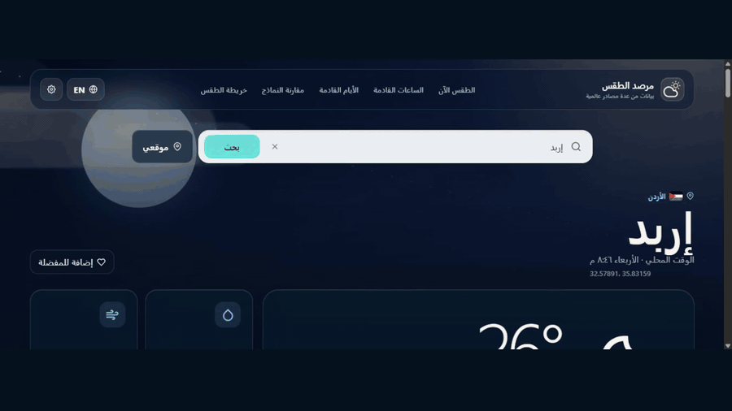
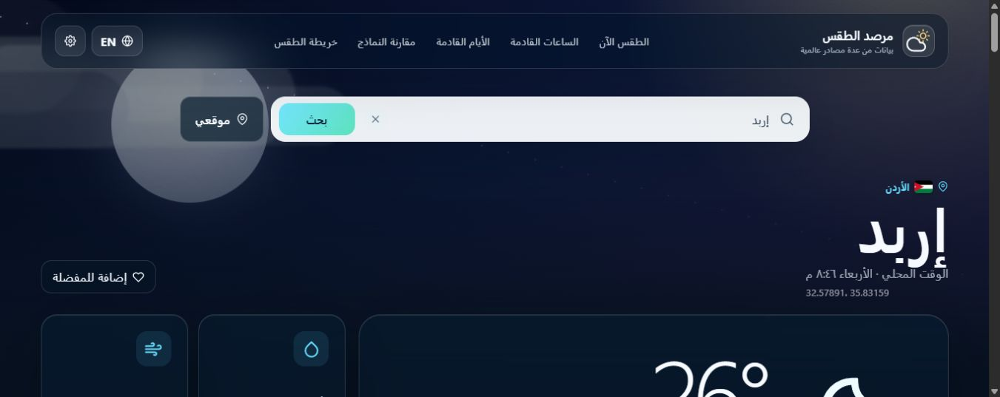
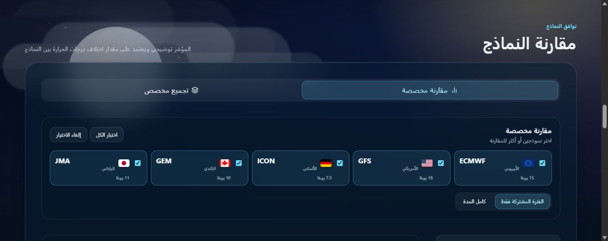
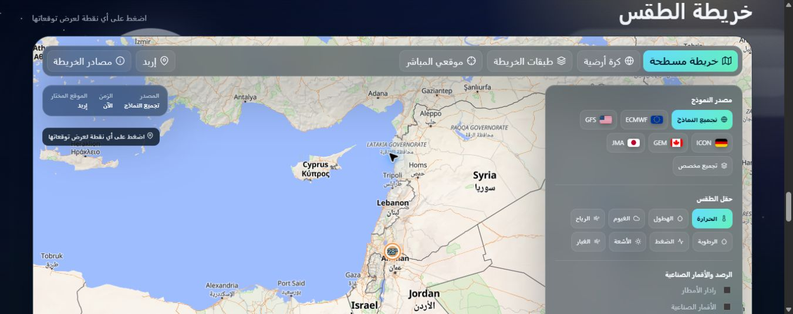

<div align="center" dir="rtl">

# مرصد الطقس العالمي

### طقسك الآن، وتوقعات أدق ..... من عدة نماذج عالمية

واجهة طقس عربية وإنجليزية تجمع التوقعات والساعات والخرائط ومقارنة النماذج العالمية في تجربة واحدة متجاوبة.

[التجربة المباشرة](https://global-weather-observatory.netlify.app) · [English documentation](docs/README.en.md) · [فيديو العرض](docs/video/weather-observatory-demo.mp4)

</div>



## نظرة عامة

مرصد الطقس تطبيق ويب تقدمي مصمم للكمبيوتر والهاتف. يعتمد على مصدر رئيسي مفتوح وخدمتين ثانويتين محميتين داخل دوال خادمية، ويعرض خمسة نماذج توقع عالمية مع توضيح مدة البيانات المتاحة لكل نموذج.



## المزايا

- واجهة عربية كاملة من اليمين إلى اليسار، مع واجهة إنجليزية اختيارية.
- بحث عن المدن بالعربية أو الإنجليزية مع تجاهل الهمزات والحركات.
- البحث باسم المدينة أو بالإحداثيات الجغرافية.
- ترجمة اسم المدينة والدولة تلقائيًا عند تبديل اللغة.
- أعلام الدول في نتائج البحث والمفضلة والموقع الحالي.
- مدن مفضلة متعددة وسجل بحث محفوظان محليًا.
- خلفيات حية تتغير حسب الطقس والوقت.
- توقعات الساعات القادمة وتفاصيل كل ساعة.
- توقعات يومية تصل إلى ستة عشر يومًا وفق مدة كل نموذج.
- مصدر موحد للتوقعات ينعكس على الساعات والأيام والخريطة.
- مقارنة مخصصة بين نموذجين أو أكثر.
- اختيار الفترة المشتركة أو كامل المدة المتاحة.
- تجميع مخصص للنماذج مع متوسطات فعلية وأعلام المشاركين.
- رسم بياني تفاعلي للمقارنة بين درجات الحرارة.
- خريطة عالمية مسطحة وكرة أرضية اختيارية.
- طبقات الحرارة والهطول والغيوم والرياح والرطوبة والضغط والأشعة والغبار.
- رادار أمطار وصور أقمار صناعية وهباء جوي وأعاصير مدارية.
- قيمة طقس واحدة عند الموقع المختار مع نطاق تقريبي لدقة النموذج.
- تحديد الموقع المباشر واختيار أي نقطة لعرض توقعاتها.
- إعدادات وحدات الحرارة والرياح والوقت وتقليل الحركة.
- مشاركة حالة الطقس كبطاقة صورة.
- قابلية التثبيت كتطبيق ويب تقدمي.
- استمرار المصدر الأساسي عند تعطل أي مصدر ثانوي.

## مقارنة النماذج



| النموذج | المنطقة | المدة القصوى المعروضة |
|---|---|---:|
| الأوروبي | أوروبا | 15 يومًا |
| الأمريكي | الولايات المتحدة | 16 يومًا |
| الألماني | ألمانيا | 7.5 أيام |
| الكندي | كندا | 10 أيام |
| الياباني | اليابان | 11 يومًا |

بعد انتهاء مدة نموذج منفرد، يستخدم التطبيق فقط النماذج التي ما تزال تملك بيانات فعلية لذلك اليوم، ويعرض أعلام النماذج المشاركة. لا تُنشأ بيانات وهمية لمدد غير متاحة.

## خريطة الطقس



تُحمّل الخريطة عند الطلب للحفاظ على أداء الهاتف. ويمكن للمستخدم اختيار الحقل الجوي والمصدر والوقت، ثم اختيار نقطة واحدة لقراءة القيمة بدل نشر أرقام متداخلة على كامل الخريطة.

## مصادر البيانات والرصد

- مصدر التوقع المفتوح: بيانات الطقس والنماذج العالمية.
- المصدر الثانوي الأول: مقارنة مستقلة للحالة والتوقع.
- المصدر الثانوي الثاني: مقارنة مستقلة إضافية.
- خريطة الأساس: خرائط وبيانات جغرافية مفتوحة.
- الرادار: صور رادار الهطول السابقة.
- الأقمار الصناعية والهباء الجوي: صور رصد فضائي.
- الأعاصير المدارية: نظام الإنذار العالمي للكوارث.

توجد الروابط والتفاصيل الفنية في [دليل المصادر](docs/DATA_SOURCES.md).

## التشغيل المحلي

```bash
npm install
npm run dev
```

ثم افتح:

```text
http://localhost:3000/
```

يمكن أيضًا استخدام ملف التشغيل المرفق على نظام ويندوز.

## البناء

```bash
npm run build
```

تُنشأ النسخة الجاهزة داخل:

```text
dist
```

## متغيرات الاستضافة

انسخ ملف المثال محليًا عند الحاجة، ولا تضع القيم السرية داخل المستودع:

```text
.env.example
```

المتغيرات الخادمية المطلوبة:

```text
WEATHERAPI_KEY
VISUALCROSSING_KEY
ALLOWED_ORIGINS
```

مفاتيح الخدمات تُحفظ في إعدادات الاستضافة فقط. لا تُرسل إلى المتصفح ولا تُضمّن في ملفات البناء.

## البنية التقنية

- واجهة تفاعلية مبنية بمكتبة واجهات حديثة ولغة أنواع ساكنة.
- أداة بناء سريعة للنسخة التطويرية والإنتاجية.
- مكتبة خرائط مفتوحة للخريطة المسطحة والكرة الأرضية.
- دوال خادمية لحماية مفاتيح المصادر الثانوية.
- تخزين محلي للمفضلة والسجل والإعدادات.
- عامل خدمة للتثبيت والتعامل المرن مع الاتصال.

للتفاصيل راجع [البنية والأمان](docs/ARCHITECTURE.md).

## الخصوصية

- لا يتطلب التطبيق إنشاء حساب.
- لا توجد إعلانات أو أدوات تتبع مضافة داخل المشروع.
- المفضلة وسجل البحث والإعدادات تبقى في متصفح المستخدم.
- الموقع الجغرافي لا يُطلب إلا عند الضغط على زر الموقع المباشر.

## الرخصة

الكود البرمجي للمشروع متاح بموجب [رخصة MIT](LICENSE)، مما يسمح باستخدامه وتعديله وتوزيعه مع الاحتفاظ بإشعار حقوق النشر والرخصة.

تبقى البيانات والخرائط والعلامات التجارية والخدمات الخارجية خاضعة لشروط ورخص مزوديها الموضحة في [دليل المصادر](docs/DATA_SOURCES.md).

## المطور

تصميم وتطوير محمد جعفر الشوحة

© 2026
